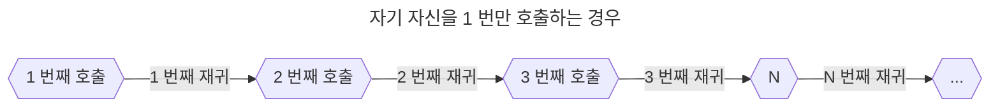
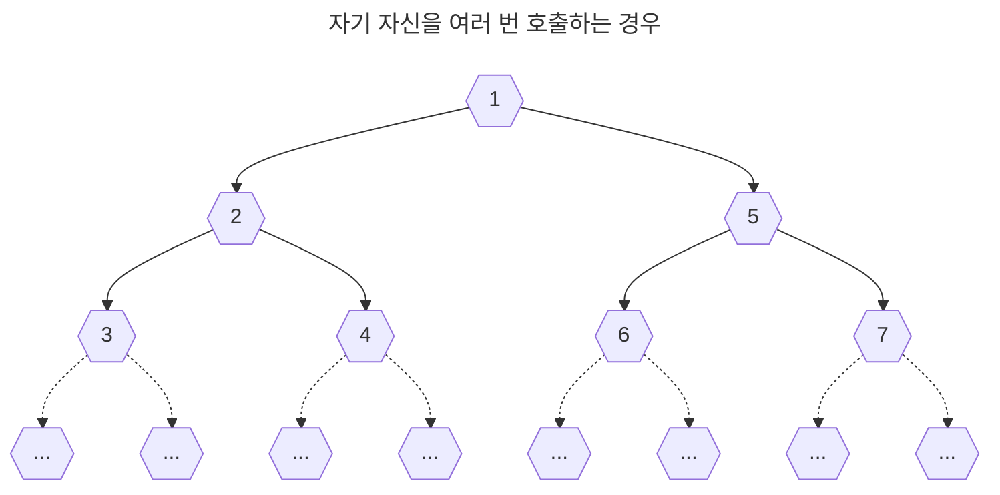

## 제목 : 재귀에 대하여 - Recursive

---

### 들어가며

재귀란 무엇일까?

재귀란, **스스로를 다시 호출하는 행위** 라고 넓게 볼 수 있다.

왜 다시 스스로를 호출하는 행동을 하며, 이것이 왜 필요해 졌을까?

이 포스팅은 스스로 **재귀 - Recursive** 라는 알고리즘이 왜 필요할까에 대해서 고찰하는 게시물이다.

 

### 배경

막연히 프로그래밍 기초를 익히던 대학생 시절에는, 그리 중요하지 않은 개념 중 하나라고 생각했다.

사실 백준 알고리즘, LeetCode 와 같은 사이트를 풀다 보면, 

재귀의 용도는 간단하게 이러한 경우가 있다.

* `Brute Force` - 모든 경우의 수 or 집합을 적용시켜 답을 확인하는 기법
* `Searching` - 원하는 답이 나올 때 까지, 스스로의 코드를 다시 실행하는 기법
* `Sorting` - 모든 배열이 정렬 될 때 까지 재귀를 실행
* `Directory` - 우리가 사용하고 있는 컴퓨터의 디렉토리를 예시로 들 수 있다.

이것 말고도 정말 수많은 적용 사례가 존재 할 것이다.

정말 다양한 길이의 배열에 대해서 조사 및 탐색을 실시할 수 있다는 점에서 매우 중요하지만,

여기엔 몇 가지 단점이 존재한다.

 

**1. 재귀는 다시 자신의 메서드를 낳으므로, 메서드를 수천만개 이상 유지하게 될 경우 계산 및 시간 오버헤드가 날 수 있다.**

재귀는 자신의 코드를 호출하는 도중 1 번만 자신의 코드를 호출할 수도 있지만, 그 이상으로 호출이 가능하다.

또한, 아직 자신이 생성한 코드가 `return` 되지 않았을 경우, 스스로는 폐기되지 않고 메모리에 유지된다.

 

**2. 무한 재귀 현상을 방지하기 위해, 종료 조건을  "정확히" 알고 있어야 한다.**

주어진 데이터에 대한 목적을 수행하기 위해 재귀를 사용하게 된다면,

해당 데이터의 조건에 따라 어떤 종료 조건을 가지고 있어야 하는지 완벽하게 이해해야 한다.

**Example**

* `1`, `2`, `3`, `4`, `5` 에 대해서 모든 순서를 내림차순으로 파악한다고 할 때,   마지막 순서는 **5 번째** 라는 것을 알고 있어야 한다.
* Quick (퀵 정렬), Merge (병합 정렬) 과 같은 재귀 코드를 실행 할 때,   정렬할 수 있는 최소 단위의 길이는 **2** 이다.

이를 똑바로 설정해 두지 않는다면, 순식간에 Stack Overflow 에러 혹은 인덱스 에러를 빨간색 글씨로 만나볼 수 있다.

 

### 재귀의 시각화

가장 쉽게 예를 들 수 있는 것은, **자기 자신을 1 번 호출한다는 개념이다.**

N 번째 까지 무사히 재귀를 마쳤을 경우, N 번째 에서 1 번째 까지 `return` 된다.

이 때 원하는 데이터가 반환되거나, 그냥 `return` 되어 있다.

 

그 다음으로 예시를 들 수 있는 것은, **여러번 재귀한다는 개념** 이다. (DFS 방식)

물론, 내부적으로 순서를 바꿀 수는 있지만, 대표적인 DFS 방식으로 이러한 순서를 가진다.

위의 그래프를 본다면, 재귀의 종료 조건을 제대로 명시하지 않는다면,

엄청나게 사용 메모리가 불어날 것이라는 것을 예측해 볼 수 있다.