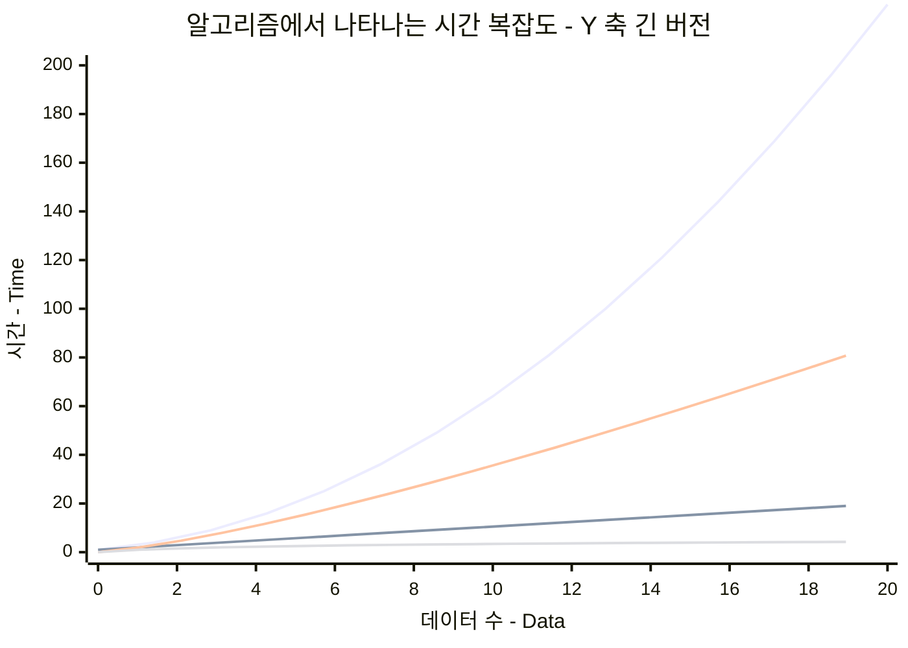
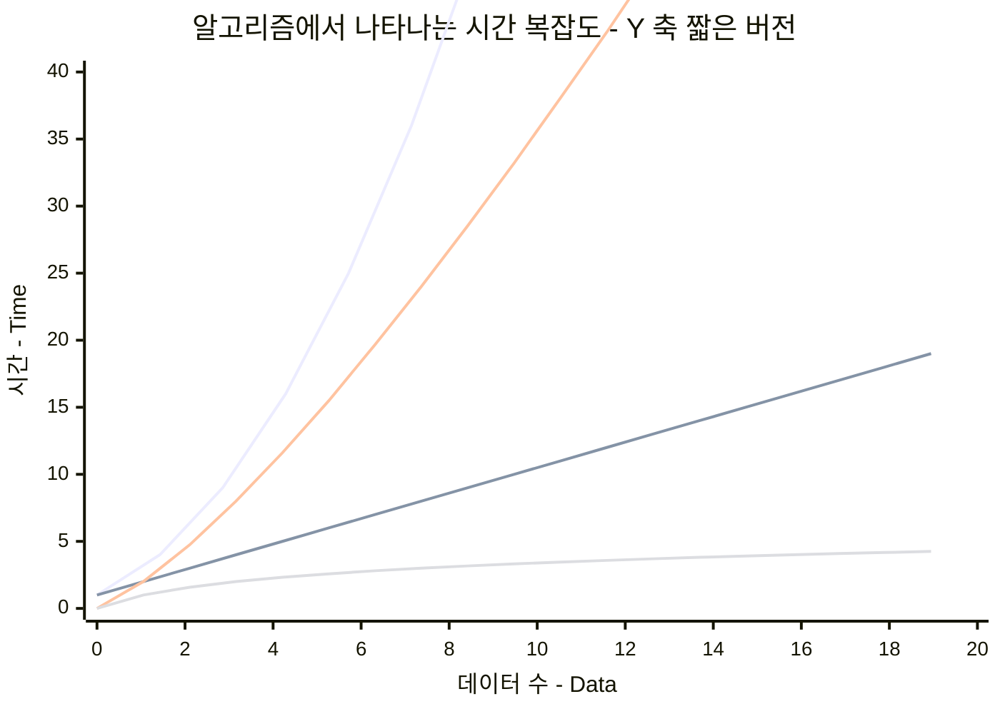

## 제목 : 수 정렬하기 2

---

### 문제

`N` 개의 수가 주어졌을 때, 이를 오름차순으로 정렬하는 프로그램을 작성하시오.

### 입력

첫째 줄에 수의 개수 `N` (1 <= `N` <= 1,000,000) 이 주어진다.

둘째 줄 부터 `N` 개의 줄에는 수가 주어진다.

이 수는 절대값이 1,000,000 보다 작거나 같은 정수이다.

수는 중복되지 않는다.

### 출력

첫째 줄 부터 `N` 개의 줄에 오름차순으로 정렬한 결과를 한 줄에 하나씩 출력한다.

<br/>

<table>
    <thead>
        <td>예제 입력</td>
        <td>예제 출력</td>
    </thead>
    <tbody>
        <tr>
            <td>
<pre>
5
5
4
3
2
1
</pre>
            </td>
            <td>
<pre>
1
2
3
4
5
</pre>
            </td>
        </tr>
    </tbody>
</table>

<br/>

---

이번 문제는 수백, 수천개의 수를 정렬하는 것에 머무르지 않고,

최대 `1,000,000` 개의 수를 정렬하게 된다.

우리가 사용할 수 있는 정렬 알고리즘들이 다양하게 존재한다.

* 선택 정렬 : Selection
* 버블 정렬 : Bubble
* 퀵 정렬 : Quick
* 병합 정렬 : Merge
* 힙 정렬 : Heap
* 듀얼 피봇 정렬 : Dual Pivot - Quick 의 상위판
* ...

<br/>

하지만, 현재 우리가 사용하는 Java 는 패키지 라이브러리로 "정렬" 기능을 제공한다.

따라서, 어떠한 배열을 생성 해 둔 뒤, `Arrays.sort(...)` 하면, 해당 배열은 정렬되어 있다.

물론, 특정 조건에 따라 역으로 정렬이 필요 할 때, `Collections...` 라는 특별 변수를 추가해야 하긴 한다.

<br/>

따라서, 이번에는 2 가지 방식으로 문제를 풀고자 한다.

1. 자바 라이브러리를 이용하여 편하게 문제 풀기
2. "직접" 정렬 알고리즘을 구현하기

<br/>

## 알아야 할 것

나 또한, 알고리즘을 접하면서 **시간 복잡도** 라는 개념을 처음 보게 되었다.

물론, 사실 대학교 2 학년 때, 시간 복잡도 라는 개념을 알게 되었다.

그 수업은 **Data Structure** (자료구조) 였는데, 사실상 알고리즘 수업이랑 동일하다고 생각된다.

나는 자료구조와 시간 복잡도의 중요성을 파악하지 못했다. 

어짜피 라이브러리가 갖추어 놨는데, 왜 이것을 중요하게 생각해야 하나? 라고 생각했다.

그런데, 나는 청개구리처럼 대학교를 졸업 한 직후, 

다양한 정렬과 자료구조를 "처음부터" 제작하게 되었다.

그 이유는 단순했다. 이제 와서 궁금했기 때문이었다.

하지만 그 과정에서 깨닫는 것이 있었다.

**대부분의 지식은 "언젠가는" 사용하게 된다**

따라서, 나는 이 글을 실제로 읽어주는 독자가 있다면 

내 지식을 언젠가는 유용하게 사용 해 주시기에 너무나도 감사하게 생각한다.

<br/>

위의 말은 사실, 시간 복잡도라는 개념 또한 **언젠가는 사용하는 지식** 이기 때문이다.

## 시간 복잡도의 간단한 그래프





각 라인이 어떠한 "증가 규칙" 이 와닿도록 2 가지 방식으로 제공해 보았다. 

맨 왼쪽부터 

1. $ N^2 $
2. $ N * \log_2(N) $
3. $ N $
4. $ \log_2(N) $

이다.

여기서 $ N * \log_2(N) $ 과 $ \log_2(N) $ 값은 GPT 한테 물어보았다.

위에서 나타내는 그래프는 생각보다 많은 도움이 될 것이다.

수학 식에 집중 할 것이 아니라, "각각 왜 증가폭의 규칙이 다른가" 를 생각 해 보자.

<br/>

### $ N^2 $ 는 어떤 상황일까?

$ N^2 $ 는 우리가 흔히 접하던 반복문에서 발견할 수 있다.

만약에, `for` 혹은 `while` 문을 중첩한다면, 바로 $ N^2 $ 가 된다.

<br/>

### $ log_2(N) $ 은 무엇을 의미하나?

먼저, 위 식에 대한 간단한 설명을 해보자면,

$ log_2(N) $ 에서 `N` 이 `1` 에 도달 할 때 까지 `2` 로 몇 번 나누어야 하는가? 이다.

그렇다면, 갑자기 시간 복잡도에서 $ log_2(N) $ 은 왜 나오는가?

<br/>

만약에, 랜덤한 수 (`1`, `4`, `8`, `11`, `15`, `30`, `80`, `100`) 이 있다고 가정 해 보자.

그런데, 컴퓨터에서는 우리가 일반적으로 이 수들을 광범위하게 시각적으로 보는 것과는 달리,

이 수들을 "하나씩" 보게 된다.

만약에, 인간인 우리가 숫자 `80` 을 찾는다고 가정해 보자.

그렇다면 화면상에 바로 보이는 숫자 `80` 은 **맨 마지막에서 2 번째 수**, 혹은 **처음부터 7 번째 수 라고 말할 수 있다.**

이제 컴퓨터가 숫자를 `80` 찾는다고 생각 해 보자.

물론, 컴퓨터는 데이터 접근 속도가 인간이 인지하지 못할 정도로 빠르므로,

처음부터 인덱스를 세서 몇 번째 숫자인지 금방 알아낼 수도 있다.

하지만, 이 수들이 `100,000` 에서 `1,000,000` 혹은 그 이상으로 가게 되면,

그 찰나의 순간들이 모여 시간이 태산처럼 걸리게 된다.

<br/>

모든 컴퓨터가 내가 설명하는 것 처럼 움직이지는 않겠지만, 대부분의 경우 이렇게 동작 할 것이다.

컴퓨터는 `80` 을 찾고있다.

1. 먼저, 위의 랜덤한 수들 (`1`, `4`, `8`, `11`, `15`, `30`, `80`, `100`) 를 저장한 메모리에 접근한다.
2. 가운데에 존재하는 수(인덱스) 에 접근한다 - (Length : `8`) - (Middle : `4`) - `arr[4] = 15`
3. 찾고자 하는 숫자인 `80` 과 `15` 를 비교한다. - `15` < `80`
4. 배열의 중앙 수가 작으므로, 그 이후의 배열을 다시 조사한다. (`30`, `80`, `100`)
5. 이 배열의 중앙 수 `80` 과 찾고자 하는 수인 `80` 을 비교한다.
6. 답을 찾는다.

위의 과정을 상세히 보았다면, 정렬된 상태의 배열에서 내가 원하는 데이터를 찾기 위해,

"$ \div2 $" 를 지속적으로 했다는 것을 알아챘을 것이다.

<br/>

그렇다면, 우리가 $ log_2(N) $ 의 의미를 다시 살펴보자.

`N` 이 `1` 이 될 때 까지, `2` 로 나누었을 때, 걸리는 횟수 를 의미한다.

**위에서 설명한 내용과 정확히 맞아떨어지지 않는가?**

물론, 이는 아예 정확하지 않다.

그러니까, 이러한 알고리즘을 적용했을 때, 최악의 수는 몇인가? 를 그래프로 나타 낸 것이다.

<br/>

### $ N $ 은 무엇인가?

사실 여기서는 각 시간 복잡도(Time Complexity) 를 효과적으로 보여주기 위해 만들어 놓았는데,

그냥 배열의 요소 혹은 어떠한 나열된 요소를 하나씩 훑고 지나갔을 때 걸리는 최대 시간을 의미한다.

<br/>

### $ N * \log_2(N)$ 은 뭐지?

위의 시간복잡도가 적용되는 경우는 주로,

* **Quick Sort**, **Merge Sort**, **Heap Sort** 이다.

그런데, 이러한 시간 복잡도가 적용되는 이유는 차차 배워가면서 알아가는 것이 좋다고 생각한다.

<br/>

위의 개념들을 익히고, 밑에서 사용되는 시간복잡도 알고리즘은 찬찬히 예측해 보길 바란다!

<br/>

---

## Answer 1 - Java 유틸 기능 이용하기

```java
import java.util.*;
import java.io.*;

public class Main {
    public static void main(String[] args) throws IOException {
        BufferedReader br = new BufferedReader(new InputStreamReader(System.in));
        
        // 정렬하게 될 길이 받기 
        int N = Integer.parseInt(br.readLine());
        
        // 배열 생성 
        int[] arr = new int[N];
        
        // 각 배열에 인자 넣기 
        for(int i = 0; i < N; i++) {
            arr[i] = Integer.parseInt(br.readLine());
        }
        
        // java.util 기능에 속하는 Arrays 기능을 이용하여 쉽게 정렬 
        Arrays.sort(arr);
        
        // 결과물을 스트링 버퍼에 담아두기 위함. - flow 방식으로 연결이 가능해서 가독성이 좋음.
        StringBuilder sb = new StringBuilder();
        
        // 결과물 결합
        for(int i = 0; i < arr.length; i++)
            sb.append(arr[i]).append("\n");
        
        System.out.println(sb.toString());
    }
}
```

**Resource 소비 결과** : 

* Memory : `112,256 KB` == `112 MB`
* Time : `1308 ms`

<br/>

`Arrays.sort` 유틸 메서드는 수많은 테스트를 거치며 최적화 된 결과물이라고 할 수 있다.

대부분의 경우, `N x log_2(N)` 의 시간복잡도를 가지게 된다.

Java 개발자들은 각각의 타입에 대해서 알맞는 정렬을 구현할 필요 없이,

Java 에서 구비해둔 정렬 메서드를 가볍게 사용하면 된다.

<br/>

## Answer 2 - 다양한 형태의 정렬 방식


### Selection sort - 선택 정렬

```java
public class Main {
    public static void main(String[] args) throws IOException {
        
    }
}
```

<br/>

### Quick sort - 퀵 정렬

```java
import java.util.*;
import java.io.*;

public class Main {
    public static void main(String[] args) throws IOException {
        BufferedReader br = new BufferedReader(new InputStreamReader(System.in));
        
        int N = Integer.parseInt(br.readLine());
        
        int[] arr = new int[N];
        
        for(int i = 0; i < N; i++) 
            arr[i] = Integer.parseInt(br.readLine());
        
        quickSort(arr, 0, arr.length - 1);
        
        StringBuilder sb = new StringBuilder();
        
        for(int i = 0; i < arr.length; i++) 
            sb.append(arr[i]).append("\n");
        
        System.out.println(sb.toString());
    }
    
    // 정렬 할 범위 선정 ==> start, end
    public static void quickSort(int[] arr, int start, int end) {
        if(start >= end) {
            return;
        }
        
        // 기준 피봇 - (arr[pivot] 은, 이 메서드 결과 중간에 삽입된다.) 
        int pivot = start;
        
        // 앞 부분을 담당하는 피봇
        int frontPivot = start;
        // 뒤 부분의 피봇 
        int backPivot = end;
        
        while(frontPivot < backPivot) {
            /*
               arr[pivot] 값을 중점으로, 뒤 쪽의 값 중, 더 작은거나 같은 것이 있다면 정지한다. (포착)     
             */
            while(arr[pivot] < arr[backPivot]) {
                backPivot--;
            }
            
            /* 
               앞의 기준점(피봇)이 뒤의 기준점 보다 뒤에 있어서는 안된다. - (그렇다면 끝난 것이기에)
               arr[pivot] 값을 중점으로, 앞 쪽의 값 중, 더 큰 것이 있다면, 정지한다. (포착) 
             */
            while(frontPivot < backPivot && arr[pivot] >= arr[frontPivot])
                frontPivot++;
            
            /*
               위 두 개의 while 문을 끝냈다면, 
               frontPivot 인덱스는 pivot 인덱스의 값 보다 큰 것을 포착한 것이다.  
               backPivot 인덱스는 pivot 인덱스의 값 보다 작거나 같은 것을 포착 한 것이다.
               
               앞 쪽은 pivot 보다 "작거나 같은 것" 이 들어와야 하며,
               뒤 쪽은 pivot 보다 "큰 것" 이 들어와야 한다.
               
               현재 arr[frontPivot], arr[backPivot] 은,
               앞쪽과 뒤쪽에 "알맞지 않은" 값을 가지고 있다는 것이다.
               즉,
               - arr[frontPivot] 은 중앙값보다 크다.
               - arr[backPivot] 은 중앙값보다 작거나 같다.
               
               따라서, frontPivot, backPivot 인덱스의 값을 바꿔주는 것이다.
             */
            int temp = arr[frontPivot];
            arr[frontPivot] = arr[backPivot];
            arr[backPivot] = temp;
        }
        
        // 한 단계로서의 퀵 정렬이 끝난 상태.
        // 정확히 "frontPivot" 인덱스에 arr[pivot] 값을 넣어준다면, 정확히 중앙을 정해주게 된다.
        int temp = arr[pivot];
        arr[pivot] = arr[frontPivot];
        arr[frontPivot] = temp;
        
        // "frontPivot" 인덱스는 정착 한 상태이므로, 이를 기준으로 나눠준다.
        quickSort(arr, start, frontPivot - 1);
        quickSort(arr, frontPivot + 1, end);
    }
}
```

**Resource 소비 결과** : 30% 에서 시간 초과.

* Memory : `Time Over`
* Time : `Time Over`

