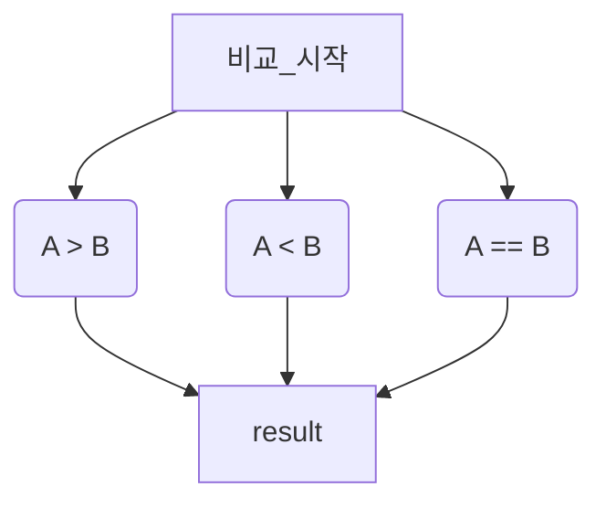
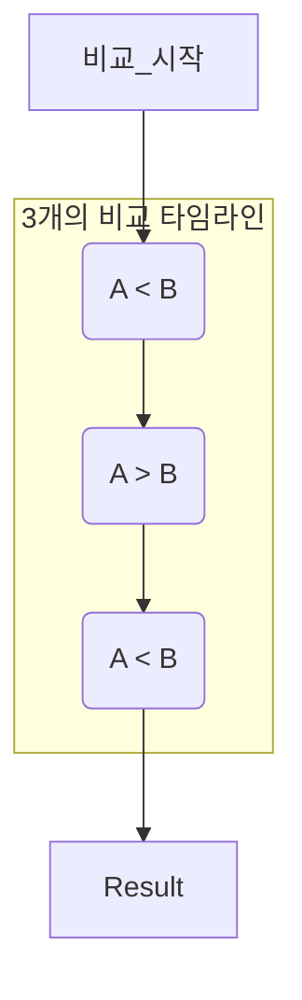

## 문제 이름 : 두 수 비교하기

---

### 문제

두 정수 `A` 와 `B` 가 주어졌을 때, `A` 와 `B` 를 비교하는 프로그램을 작성하시오.

### 입력

첫째 줄에 `A` 와 `B`가 주어진다.

`A` 와 `B` 는 공백 한 칸으로 구분되어져 있다.

### 출력

첫째 줄에는 다음 세 가지 중 하나를 출력한다.

* `A` 가 `B` 보다 **큰** 경우에는 `>` 를 출력한다.
* `A` 가 `B` 보다 **작은** 경우에는 `<` 를 출력한다.
* `A` 와 `B` 가 같은 경우에는 `==` 를 출력한다.

### 제한

**-10,000** <= `A`, `B` <= **10,000**

### 예제 입력 1

```text
1 2
```

### 예제 출력 1

```text
<
```

<br/>

### 예제 입력 2

```text
10 2
```

### 예제 출력 2

```text
>
```

<br/>

### 예제 입력 3

```text
5 5
```

### 예제 출력 3

```text
==
```

---

대부분 프로그래밍 언어의 비교 연산자는 `>`, `<`, `==`, `>=`, `<=` `!=` 등이 있다.

비교 연산자의 전자, 후자의 값을 비교하여 `true` or `false` 의 값을 낸다.

<br/>

일단 처음으로 본다면, 이를 **수의 비교** 로 인지하는 것이 추후 어려운 알고리즘을 푸는데 도움이 된다.

나중에는 **수의 비교**를 넘어서, **상황의 비교** 가 좀 더 적당한 의미가 될 정도로 중요하다.

`1 > 0` 을 생각해보자. 그렇다면, 당연하다고 생각 할 것이다.

따라서, 위의 조건문 결과는 `true`이다.

그 다음으로, `1 > 2` 를 생각해보자. 말도 안되는 소리라고 생각할 것이다.

따라서, 위의 조건문 결과는 `false` 이다.

<br/>

필자는 수의 비교가 아닌, 최대한 의식의 흐름으로 제시했다.

아 물론, 수의 비교가 가장 정확하며, 당연히 수의 비교로 정의하는 것이 맞다.

그렇지만, 수의 비교에 중점을 두다가, 중첩된 수의 비교에 생각이 지쳐서 틀리는 경우가 존재하기 때문이다.

원하는 대로 생각하면 된다.

<br/>

## Answer 1 - Primitive Type 인 int 사용

```java
import java.util.*;
import java.io.*;

public class Main {
    public static void main(String[] args) throws IOException {
        BufferedReader br = new BufferedReader(new InputStreamReader(System.in));
        
        StringTokenizer st = new StringTokenizer(br.readLine());
        
        int A = Integer.parseInt(st.nextToken());
        int B = Integer.parseInt(st.nextToken());
        
        if(A > B) {
            System.out.println(">");
        } else if (A < B) {
            System.out.println("<");
        } else { // A == B
            System.out.println("==");
        }
    }
}
```

`if`, `while`, `for` 내부에 들어가는 **모든** 조건문은 

`true` 혹은 `false` 가 나올 수 있는 형태이어야 한다.

두 가지 상황으로 딱 나뉠 수 있는 문장이어야 한다는 의미다.

<br/>

이 상황은 A 와 B 의 비교만을 다루므로, 비교 타임라인은 **1** 개라고 말할 수 있다.

밑의 그래프를 봐보자.



`if`, `else if`, `else` 라는 문법을 이어 붙여서,

비교 타임라인을 **하나** 로 만든 것이다.

<br/>

그렇다면, 만약 `if`, `else if`, `else` 가 아닌,

`if`, `if`, `if` 로 하면 어떻게 될까?

## Wrong Answer - 3 개의 if

---

```java
import java.util.*;
import java.io.*;

public class Main{
    public static void main(String[] args) throws IOException {
        BufferedReader br = new BufferedReader(new InputStreamReader(System.in));
        
        StringTokenizer st = new StringTokenizer(br.readLine());
        
        int A = Integer.parseInt(st.nextToken());
        int B = Integer.parseInt(st.nextToken());
        
        if(A > B) {
            System.out.println(">");
        }
        if(A < B) {
            System.out.println("<");
        }
        if(A == B) {
            System.out.println("==");
        }
    }
}
```

물론, `A` 와 `B` 의 두 수의 조건만을 다루므로, 답은 일치한다.

그렇지만, 비교 조건문의 타임라인은 총 **3** 개이다.

밑에 그래프를 그려 놓으니, 위의 그래프와 차이점을 보자.

귀찮다고 스크롤 확확 넘기면 당신의 논리적 성장 한계는 너무 명확해진다.

나도 초보일 지도 모르는 독자들을 위해 친절하게 `mermaid` 그래프로 그려놓는다.

**3 개의 타임으로 나뉘어버림**



위의 그래프와 같이, 3 개의 비교 타임라인을 가지며, 원치 않는 결과를 가져올 수 있다는 것을 명심하자.

<br/>

## Answer 2 - Class Type Integer

```java
import java.util.*;
import java.io.*;

public class Main {
    public static void main(String[] args) throws IOException {
        BufferedReader br = new BufferedReader(new InputStreamReader(System.in));
        
        StringTokenizer st = new StringTokenizer(br.readLine());
        
        Integer A = Integer.parseInt(st.nextToken());
        Integer B = Integer.parseInt(st.nextToken());
        
        if(A.compareTo(B) == -1) { //  A < B
            System.out.println("<");
        } else if(A.compareTo(B) == 1) { // A > B
            System.out.println(">");
        } else if(A.equals(B)) { // A.compareTo(B) == 0 || A == B
            System.out.println("==");
        }
    }
}
```

인스턴스화 가능은 숫자 타입의 클래스는 따로 비교 메서드가 존재한다.

클래스에 있어서 비교는 무엇이라고 생각하는가?

물론, Numeric 타입인 Double, Integer, Long 과 같은 숫자들은 비교 연산자가 구현되어 있을 수도 있다.

하지만, 일단 인스턴스 변수의 비교는 **"주소의 비교"** 가 되는 것이다.

즉, **"이 인스턴스와 저 인스턴스는 동일한 인스턴스인가요?"** 이거나,

**"두 인스턴스는 동일한 주소를 참조하고 있나요?"** 라고 묻는 것이다.

따라서, 클래스를 위한 비교 연산자, `compareTo()` 를 사용하는 것이 선호된다.

<br/>

프로그램은 클래스 내부에 속한 고유의 변수를 자동으로 빼서 계산 해 주지 않는다.

물론, 정말 자유도가 높은 상급 언어는 가능 할 수도 있다.

허나, 그렇지 않다면 주어진 메서드(Java API)를 이용하여 비교하거나,

메서드를 직접 구현하여 비교해야 하는 것이다.

<br/>

나중에 `String` 문자열 타입을 이용한 비교를 하게 될 텐데,

이 때 비교 연산자는 먹히지 않는다는 것을 **절대로** 숙지해라.

`String` 은 **Primitive** 가 아니라, **Class** 이다.

