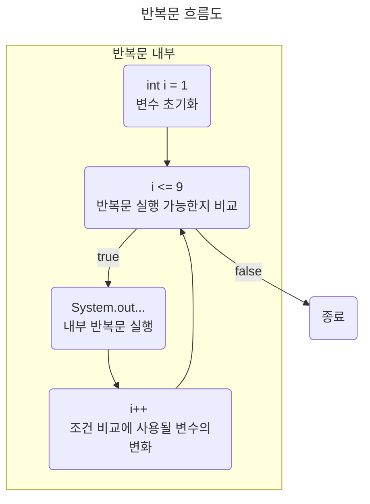

## 문제 이름 : 구구단

---

### 문제

`N` 을 입력받은 뒤, 구구단 `N` 단을 출력하는 프로그램을 작성하시오.

출력 형식에 맞춰서 출력하면 된다.

### 입력

첫째 줄에 `N` 이 주어진다.

`N` 은 `1` 보다 크거나 같고, `9` 보다 작거나 같다.

<br/>

### 예제 입력 1

```text
2
```

### 예제 출력 2

```text
2 * 1 = 2
2 * 2 = 4
2 * 3 = 6
2 * 4 = 8
2 * 5 = 10
2 * 6 = 12
2 * 7 = 14
2 * 8 = 16
2 * 9 = 18
```

---

`true` or `false`의 결과로 로직을 결정할 수 있는 조건문과 더불어,

**어떠한 조건에 다다를 때 까지 반복** 하는 **반복문** 이라는 것이 존재한다.

반복문 또한 **어떠한 조건** 이라는 위와 같은 필요사항이 필요하기 때문에, 

조건문의 의미에 대해서 다시 생각해 보는 것이 좋다.

<br/>

그렇다면, Java 라는 언어에서 반복문을 사용 할 수 있는 방법은 무엇일까?

기본적으로 모든 프로그래밍 언어에 통용되는 방식으로, `for` 과 `while` 이 대표적으로 존재한다.

`for` 의 경우, `Iterator` 클래스와 비슷하게 동작하는 `for(타입 엘리먼트 : 배열)` 라는 변형식이 존재하며,

`while` 의 경우, `do { ... } while( 조건문 )` 의 형태로, 먼저 실행 후 조건문을 살펴보는 변형식이 존재한다.

이러한 약간 다른 변형식들은 코드의 가독성을 올려 주기도 하지만,

배열의 인덱스 직접 접근이 불편하다는 단점이 존재한다.

특히, 알고리즘과 같이 인덱스에 매우 민감한 사항들은,

개인적으로 기본형을 사용하는 것이 더 낫지 않을까 생각되기도 한다.

<br/>

반복문 문제는 `for` 과 `while` 두 개의 방법으로 모두 해결 할 수 있다.

문제를 편하게 해결하기 위해 사용되는 반복문은 서로 다르기도 하지만, 그 결은 비슷하다고 할 수 있다.

이 문제는 **구구단 출력** 문제이다. 따라서, 인덱스 접근에 용이한 `for` 문이 더 알맞다.

이러한 두 반복문의 차이점을 보여주기 위해 `for` 방식과 `while` 방식을 모두 보여주겠다.

<br/>

## Answer 1 - for 문 이용

```java
import java.util.*;
import java.io.*;

public class Main {
    public static void main(String[] args) throws IOException {
        BufferedReader br = new BufferedReader(new InputStreamReader(System.in));
        
        int N = Integer.parseInt(br.readLine());
        
        for(int i = 1; i <= 9; i++)
            System.out.println(N + " * " + i + " = " + N * i);
    }
}
```

`for` 문과 `while` 문 내용의 문장이 **한 줄** 이라면, 중괄호를 쳐도, 치지 않아도 동일하게 취급된다.

일단 `for` 문을 살펴보자.

일반적인 상황에서, 숫자를 이용하여 어떠한 조건의 수에 도달 할 때 까지 반복된다.

```text
for( 비교 조건에 사용될 수 초기화; 또다시 반복을 시작할 비교 조건 선언; 내부 반복문 한번 실행 이후 변수의 변화 )
```

이를 한 번 대입해 보자.

* `int i = 1` : 비교 조건에 사용될 수 초기화
* `i <= 9` : 또다시 반복을 시작할 비교 조건 선언
* `i++` : 내부 반복문을 한번 실행한 이후 변수의 변화

여기서 `int i` 는 지역적으로 사용되는 변수이며, 반복문이 종료되면 없어질 임시 변수이다.

이를 직관적으로 이해 할 수 있게 해석을 해 보겠다 :

1. 내부에서 반복 조건으로 사용될 `i` 를 `1` 로 선언한다.
2. `i` 는 `9` 와 동일하거나 작을 때 까지만 내부의 반복문을 실행한다.
3. 내부의 반복문이 한 번 실행하고 난 이후 `i` 에 `1` 을 더한다.

<br/>

실행 순서 또한 그래프로 그려 보겠다. 참고 : (mermaid - flowchart 사용)



내부에서 발생되는 반복문의 흐름은 이런 식으로 이루어진다.

기본적인 `for` 문은 가장 간편하게 반복문을 자세하게 **커스터마이징** 할 수 있는 방식이다.

직접적인 인덱싱 접근부터, 종료 조건 선언, 그리고 종료 조건에 속하는 변수의 변화까지도 커스터마이징이 가능하다.

<br/>

그렇다면, 이번에는 `while` 문으로 이를 풀어 보겠다.

위에서 이러한 문제는 `while` 보다 `for` 문이 더 알맞다고 했는데,

왜 그런지는 코드를 살펴보자.

## Answer 2 - while 문 이용

```java
import java.util.*;
import java.io.*;

public class Main {
    public static void main(String[] args) throws IOException {
        BufferedReader br = new BufferedReader(new InputStreamReader(System.in));
        
        int N = Integer.parseInt(br.readLine());
        
        int i = 1;
        while(i <= 9) {
            System.out.println(N + " * " + i + " = " + N * i);
            i++; // i = i + 1 과 동일함.
        }
    }
}
```

`while` 반복문에 대해서 먼저 살펴보겠다.

```text
while( 이 비교식이 "true" 이면 내부의 반복문을 실행한다 ) {
    반복되서 실행될 문장;
}
```

`for` 과 달리, `while` 은 괄호 내부에 **조건식** 하나만 들어간다.

따라서, 반복에 사용될 변수 `i` 를 바깥에서 따로 설정하고,

`i` 의 변화를 **실행문** 내부에서 따로 변화시켜줘야 한다.

같은 반복문의 맥락으로서 `while` 문으로 보여줬지만, 오히려 가독성 면에서는 떨어진다.

그 이유는, 코드가 굉장히 길다면,

`int i = 1` 과 `i++` 의 선언이 **어느 부분에서** 이루어 질지 읽기 어렵기 때문이다.

따라서, 이 문제는 반복되는 변수 `i` 의 사용이 가장 직접적으로 이루어지므로,

`for` 문을 사용하여 푸는 것이 더 타당하다고 볼 수도 있다.

이러한 것이 싫다면, `while` 을 사용하는 것도 괜찮다.
