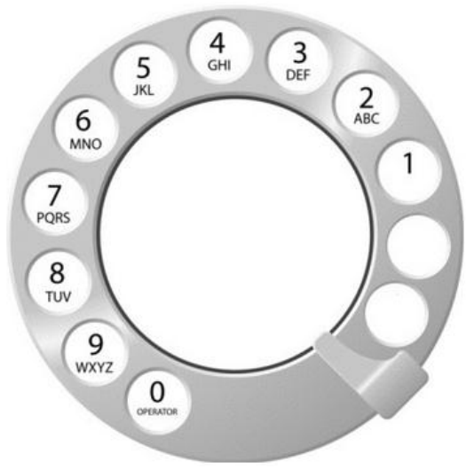

## 문제 이름 : 다이얼

---



<br/>

### 문제

전화를 걸고 싶은 번호가 있다면, 숫자를 하나 누른 후, 금손 핀이 있는 곳 까지 **시계방향** 으로 돌려야 한다.

숫자를 하나 누르면, 다이얼이 처음 위치로 돌아가고,

다음 숫자를 누르려면 다이얼을 처음 위치에서 다시 돌려야 한다.

<br/>

숫자 `1` 을 걸려면, 총 **2** 초가 필요하다.

1 보다 큰 수를 거는데 걸리는 시간은 이보다 더 걸리며,

한칸 옆에 있는 수자를 걸기 위해선 **1** 초씩 더 걸린다.

**상근이의 할머니는 전화 번호를 각 숫자에 해당하는 문자로 외운다**.

즉, 어떤 단어를 걸 때, 각 알파벳에 해당하는 수자를 걸면 된다.

<br/>

예를 들어, `UNUCIC` 는 `868242` 와 동일하다.

할머니가 외운 단어가 주어졌을 때, 이 전화를 걸기 위해서 필요한 **최소 시간** 을 구하는 프로그램을 작성하시오.

### 입력

첫째 줄에 알파벳 대문자로 이루어진 단어가 주어진다.

단어의 길이는 `2` 보다 크거나 같고, `15` 보다 작거나 같다.

### 출력

첫째 줄에 다이얼을 걸기 위해서 필요한 최소 시간을 출력한다.

<br/>

### 예제 입력 1

```text
WA
```

### 예제 출력 1

```text
13
```

<br/>

### 예제 입력 2

```text
UNUCIC
```

### 예제 출력 2

```text
36
```

<br/>

---

내가 처음에 알고리즘을 시작했을 때, 문제는 정말로 **간단함에도 불구하고**

문제의 설명으로 인해 엄청난 혼란을 겪었던 문제이다.

문제의 상세한 내용을 읽어 요구사항을 파악하는 것도 중요하지만,

특히 이러한 구현 문제는 **걸러 들어야 할 것은 무엇인가** 파악하는 것도 중요하다고 생각한다.

<br/>

## 걸러 들어야 할 설명은 무엇인가

<br/>

### 1. **다이얼의 전화 과정의 구조** 전체를 삭제해라

문제에서는 **다이얼의 전화 과정** 으로 인해, 반시계로 갈 수록 **1초** 씩 늘어난다고 써 있다.

이는 당연히 귀담아 들어야 할 문장이다.

하지만, 이를 머리로 시뮬레이션 하면, 도대체 해당 과정의 시간이 그렇게나 오래 걸릴 것인가 생각이 든다.

결국 말하고자 하는 바는, **다이얼을 돌린다** 라는 것이 아니라,

해당 번호를 입력하기 위해서 **이렇게나 시간이 걸린다** 라고 인식해야 한다는 것이다.

<br/>

### 2. 1 번을 입력하기 위해서 2 초가 걸린다.

이 문장은 왜 걸러서 들어야 할까?

가장 중요한 이유는, 숫자 **1** 에 알맞는 **알파벳** 이 존재하지 않기 때문이다.

할머니는 **알파벳** 으로 번호를 입력한다고 했다.

그런데, `1` 번의 이미지를 살펴보면, 어떠한 알파벳도 할당되어 있지 않다.

즉, 우리는 알파벳을 입력받으므로, **1** 번을 입력받을 수 없다는 것을 인지해야 한다.

<br/>

물론, 반시계 방향으로 돌림으로서, **만약에** 1번이 입력된다면, 2초가 걸린다는 것은

인지를 하지만, **1번** 그 자체가 입력 될 상황은 벌어지지 않는다.

<br/>

---

자 이쯤이면, 정확히 이 문제가 의미하는 바를 이해했을 거라고 생각한다.

할머니가 **번호를 외우는 방식** 은 **알파벳** 을 의미한다.

`0`, `1` 번을 제외한 모든 번호는 **알파벳들** 이 할당되어 있다.

**입력** 으로 알파벳이 들어온다면, 해당 알파벳을 가지고 있는 **수**를 번역하면 된다.

<br/>

여기서 우리는 **조건문의 방식** 을 선택하면 된다.

`if-else` 를 사용해도 되며,

`switch` 방식을 사용해도 된다.

<br/>

코드의 사용처와 방식을 따져보았을 때,

방대한 수의 범위 따위를 따지는 것이 아니기 때문에 `switch` 조건문이 가장 알맞긴 하다.

물론, `if-else` 문법을 사용해도 상관은 없다.

<br/>

## Answer 1 - switch 문법 사용

```java
import java.util.*;
import java.io.*;

public class Main {
    public static void main(String[] args) throws IOException {
        BufferedReader br = new BufferedReader(new InputStreamReader(System.in));
        
        // 할머니가 외운 알파벳을 입력받는다. 
        String strNumber = br.readLine();
        
        int totalTime = 0;
        
        for(int i = 0; i < strNumber.length(); i++) {
            char ch = strNumber.charAt(i);
            totalTime += chToTime(ch);
        }
        System.out.println(totalTime);
        
    }
    
    public static int chToTime(char ch){
        switch (ch) {
            case 'A': case 'B': case 'C':
                return 3;
            case 'D': case 'E': case 'F':
                return 4;
            case 'G': case 'H': case 'I':
                return 5;
            case 'J': case 'K': case 'L':
                return 6;
            case 'M': case 'N': case 'O':
                return 7;
            case 'P': case 'Q': case 'R': case 'S':
                return 8;
            case 'T': case 'U': case 'V':
                return 9;
            case 'W': case 'X': case 'Y': case 'Z':
                return 10;
            default:
                return -1;
        }
    }
}
```

<br/>

## Answer 2 - if else 조건문 사용

```java
import java.util.*;
import java.io.*;

public class Main {
    public static void main(String[] args) throws IOException {
        BufferedReader br = new BufferedReader(new InputStreamReader(System.in));
        
        // 할머니가 외운 알파벳을 입력받는다. 
        String strNumber = br.readLine();
        
        int totalTime = 0;
        
        for(int i = 0; i < strNumber.length(); i++) {
            char ch = strNumber.charAt(i);
            totalTime += chToTime(ch);
        }
        System.out.println(totalTime);
        
    }
    
    public static int chToTime(char ch){
        if(ch == 'A' || ch == 'B' || ch == 'C') {
            return 3;
        } else if (ch == 'D' || ch == 'E' || ch == 'F') {
            return 4;
        } else if (ch == 'G' || ch == 'H' || ch == 'I') {
            return 5;
        } else if (ch == 'J' || ch == 'K' || ch == 'L') {
            return 6;
        } else if (ch == 'M' || ch == 'N' || ch == 'O') {
            return 7;
        } else if (ch == 'P' || ch == 'Q' || ch == 'R' || ch == 'S') {
            return 8;
        } else if (ch == 'T' || ch == 'U' || ch == 'V') {
            return 9;
        } else if (ch == 'W' || ch == 'X' || ch == 'Y' || ch == 'Z') {
            return 10;
        } else {
            return -1;
        }
    }
}
```