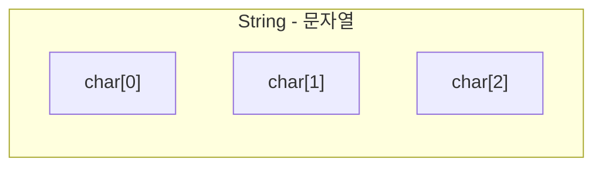
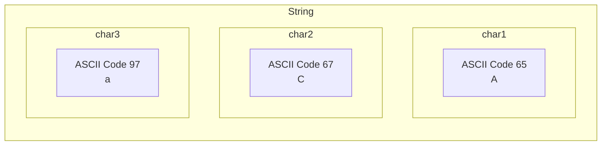

## 문제 이름 : 아스키 코드

---

### 문제

알파벳 소문자, 대문자, 숫자 `0` ~ `9` 중 하나가 주어졌을 때,

주어진 글자의 아스키 코드값을 출력하는 프로그램을 작성하시오.

### 입력

알파벳 소문자, 대문자, 숫자 0-9 중 하나가 첫째 줄에 주어진다.

### 출력

입력으로 주어진 글자의 아스키 코드 값을 출력한다.

<br/>

### 예제 입력 1

```text
A
```

### 예제 출력 1

```text
65
```

<br/>

### 예제 입력 2

```text
C
```

### 예제 출력 2

```text
67
```

<br/>

### 예제 입력 3

```text
0
```

### 예제 출력 3

```text
48
```

<br/>

### 예제 입력 4

```text
9
```

### 예제 출력 4

```text
57
```

<br/>

### 예제 입력 5

```text
a
```

### 예제 출력 5

```text
97
```

<br/>

### 예제 입력 6

```text
z
```

### 예제 출력 6

```text
122
```

<br/>

---

이번에는 **ASCII CODE** 에 대해서 배우는 문제이다.

문자와 관련된 모든 데이터는 **아스키 코드** 와 관련이 있다.

그것이 1개, 혹은 그 이상의 개수 또한 **아스키 코드** 와 관련이 무조건 있다.

<br/>

**문자열** 이란, **문자** 를 나열 한 객체이다.

즉, 대부분의 프로그래밍 언어에서 `String` 객체는 스스로의 `char` 배열을 가지고 있다.



그렇다면, `char` 즉, **Character** 유형의 데이터는 무엇일까?

<br/>

`char` 유형의 변수는 표면적으로는 **하나의 문자** 를 지칭하고, 출력할 수 있다.

하지만, `(int)(char 유형 변수)` 로 쉽게 **ASCII CODE** 로 변환이 가능하다.

이 때, 아스키 코드는 **정수** 유형이다.

<br/>

컴퓨터 화면에는 **문자들** 이 표현되지만, 컴퓨터는 **숫자**(이진법) 을 인식한다.

그렇다면, 우리가 사용하는 **문자** 를 컴퓨터에게 인식시키는 방법이 무엇일까?

<br/>

바로 **ASCII Code** 이다.

아스키 코드는 특수문자, 문자, 숫자 등 화면에 표현될 수 있는 문자들을 **숫자** 로 가지고 있다.

궁금하다면, 직접 `아스키 코드` 로 검색하면 된다.

<br/>

한글은 하나의 글자당 2 BYTE 가 부여되는데, 이는 자음과 모음의 결합 때문이다.

한글은 현재 사용될 일이 없지만, 이것 또한 궁금하다면 직접 검색하여 어떻게 컴파일링 되는지 확인해 보면 된다. 

<br/>

바로 우리가 컴퓨터에게 입력하는 모든 문자들은, 일단 숫자로 인식할 수 있는 **ASCII CODE** 로 변환된다.

아스키 코드 **하나당** 하나의 문자를 의미하며, 이러한 아스키 코드 문자들이 모여 **문자열**(String) 을 형성한다.



* `String` : `"ACa"`
* 인덱스 1 : `A` - 아스키 코드 65
* 인덱스 2 : `C` - 아스키 코드 67
* 인덱스 3 : `a` - 아스키 코드 97


<br/>

이쯤되면, 이제 문제에서 원하는 것이 무엇인지 나오게 된다.

단순히 문자를 문자로 인식하려 하지 말고, 하나의 숫자 측면으로 볼 수 있는 시야를 제공해 준 것이다.

<br/>

우리가 진행해야 할 과정은 이와 같다 :

1. 입력을 **문자열** 로 받게 된다.
2. 모든 입력은 길이 1의 **문자열** 이므로, 문자열의 인덱스 1 을 추출한다.
3. 이 때, 추출되는 데이터는 `char` 변수로 담는다.
4. `char` 문자 하나는 `(int)` 와 같은 자바 Parsing 방식으로 쉽게 변환이 가능하다.
5. 변환된 `char` 은 **ASCII CODE** 를 의미하므로, 그대로 출력하면 된다. 

<br/>

## Answer 1 - 흐름 시각화 

```java
import java.util.*;
import java.io.*;

public class Main {
    public static void main(String[] args) throws IOException {
        BufferedReader br = new BufferedReader(new InputStreamReader(System.in));
        
        String inputData = br.readLine();
        
        char character = inputData.charAt(0);
        
        int ASCII_DATA = (int)character;
        
        System.out.println(ASCII_DATA);
    }
}
```

<br/>

## Answer 2 - 코드 정리

```java
import java.util.*;
import java.io.*;

public class Main {
    public static void main(String[] args) throws IOException {
        BufferedReader br = new BufferedReader(new InputStreamReader(System.in));
        
        System.out.println((int)br.readLine().charAt(0));
    }
}
```

