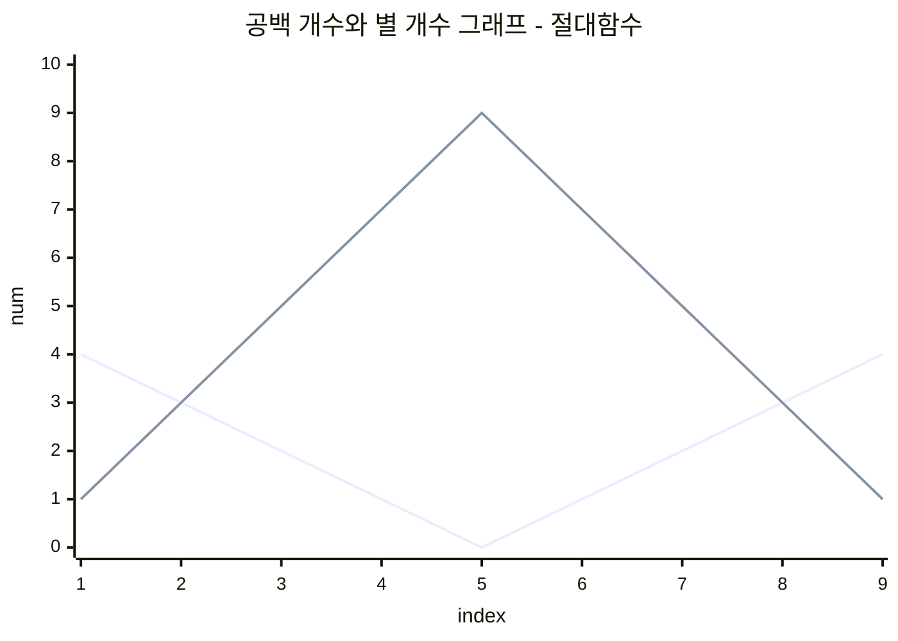

## 문제 제목 : 별 찍기 - 7

---

### 문제

예제를 보고 규칙을 유추 한 뒤에 별을 찍어 보세요.

### 입력

첫째 줄에 `N` ( 1 <= `N` <= 100 ) 이 주어진다.

### 출력

첫째 줄 부터 `2 * N - 1` 번째 줄 까지 차례대로 별을 출력한다.

<br/>

### 예제 입력 1

```text
5
```

### 예제 출력 1

```text
    *
   ***
  *****
 *******
*********
 *******
  *****
   ***
    *
```

---

<br/>

별 찍기 문제는 하나의 방향으로 점화식이 만들어 지지만,

이 문제는 혼란스럽게도, 증가와 감소의 경향을 동시에 보여주고 있다.

<br/>

먼저 확실히 해야 하는 것은, 공백(`' '`) 과 별(`'*'`) 이 순서대로 나온다는 것이다.

공백의 증감, 별의 증감 요소를 살펴보는 것이다.

**예제 출력 1** 을 살펴보면,

먼저 공백이 줄어들며, 별이 점점 증가한다.

중반 이후부터, 공백이 증가하며, 별이 점점 감소한다.

<br/>

그렇다면 점화식은 2개일까?

`N` 이 5 라면, 5 까지의 점화식과,

5 이후의 점화식이 다른것일까?

<br/>

물론 주어진 `N` 을 기점으로, 점화식을 2 개로 나눌 수도 있다.

하지만, 나는 처음에 공백과 별의 증감을 신경써야 한다고 했다.

그렇다면, 인덱스에 따른 그래프의 증감을 시각적으로 본다면, 답이 나오기가 굉장히 쉬워진다.

<br/>

**Table** : 

| 번째    | 1 | 2 | 3 | 4 | 5 | 6 | 7 | 8 | 9 |
|-------|---|---|---|---|---|---|---|---|---|
| 공백 개수 | 4 | 3 | 2 | 1 | 0 | 1 | 2 | 3 | 4 |
| 별 개수  | 1 | 3 | 5 | 7 | 9 | 7 | 5 | 3 | 1 |

<br/>

즉, 하나의 방향으로만 증가 혹은 감소하다가, 똑같은 방향으로 증가 혹은 감소한다면,

이는 **절대함수** 의 형태를 취한다는 것이다.

<br/>



<br/>

그렇다면, 입력되는 `N` 값에 대한 함수를 각각 구할 수 있다.

<br/>

공백 개수 : 인덱스 영역 (1 <= index <= 2 * N - 1)

`y = | -x + N |` :: x 는 인덱스, y 는 결과값

<br/>

별 개수 : 인덱스 영역 (1 <= index <= 2 * N - 1)

* 기울기 : 2
* 기울기 변동지점 : 5 == N
* 변동지점에서의 최대 높이 : 9 = (2N - 1)
* 절대함수 x 축 거꾸로

**Result** : `( -1 * | 2(x - 5) | ) + 9`

==> `( -1 * | 2(x - N) | ) + (2N - 1)` 

즉, 절대로 양수가 될 수 없는 y = -|x| 에서 변형 된 것이다.

이를 종합한다면, 별의 개수는 위의 식을 따른다.

<br/>

그리고, 절대값을 구하는 것은 직접 만들수도 있고, 혹은 라이브러리를 사용 할 수 있다.

Example : `Math.abs(숫자)`

<br/>

### 결론

공백 : `y = | -x + N |` - 1부터 시작 

별 : `( -1 * | 2(x - N) | ) + (2N - 1)` - 1부터 시작 

<br/>

## Answer

```java
import java.util.*;
import java.io.*;

public class Main {
    public static void main(String[] args) throws IOException {
        BufferedReader br = new BufferedReader(new InputStreamReader(System.in));
        
        int N = Integer.parseInt(br.readLine());
        
        StringBuilder sb = new StringBuilder();
        for(int i = 1; i < 2 * N; i++) {
            int blank = abs(-1 * i + N);
            int star = -1 * abs(2 * (i - N)) + (2 * N - 1);
            for(int j = 0; j < blank; j++)
                sb.append(' ');
            for(int j = 0; j < star; j++)
                sb.append('*');
            
            sb.append("\n");
        }
        
        System.out.println(sb.toString());
    }
    public static int abs(int num){
        if(num < 0)
            return -1 * num;
        else
            return num;
    }
}
```


