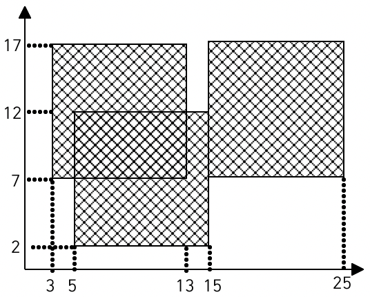

## 제목 : 색종이

---

### 문제

가로, 세로의 크기가 각각 100 인 정사각형 모양의 흰색 도화지가 있다.

이 도화지 위로 가로, 세로의 크기가 각각 10인 정사각형 모양의 검은색 색종이를,

색종이의 변과 도화지의 변이 평행하도록 붙인다.

이러한 방식으로 색종이를 한 장 또는 여러 장 붙인 후, 

색종이가 붙은 검은 영역의 넓이를 구하는 프로그램을 작성하시오.

<br/>



예를 들어, 흰색 도화 위에 세 장의 검은색 색 종이를,

그림과 같은 모양으로 붙였다면, 검은색 영역의 넓이는 260 이 된다.

### 입력

첫째 줄에 색종이의 수가 주어진다..

이어 둘째 줄부터 한 줄에 하나씩 색종이를 붙인 위치가 주어진다.

색종이를 붙인 위치는 두 개의 자연수로 주어진다.

첫 번째 자연수는 색종이의 왼쪽 변과 도화지의 왼쪽 변 사이의 거리이고,

두 번쨰 자연수는 색종이의 아래쪽 변과 도화지 아래쪽 변 사이의 거리이다.

색종이의 수는 100 이하이며, 

색종이가 도화지 밖으로 나가는 경우는 없다.

<br/>

### 예제 입력 1

```text
3
3 7
15 7
5 2
```

### 예제 출력 1

```text
260
```

<br/>

---

처음 이 문제를 본다면, 먼저 겹쳐진 부분의 영역을 제거해야 하나?

이러한 의문이 들 수도 있다.

<br/>

특히, 그래프에서 보여지는 특정한 지점의 값은, 

더더욱이 겹쳐진 부분의 영역을 따로 제거하는 메서드를 작성해야 하나라는 의문이 들게끔 만든다.

<br/>

하지만, 각자 걸쳐진 상태로 2번, 3번 정사각형인 검은 도화지가 겹쳐진다면 어떻게 할 것인가?

그 때는 그래프 상에서 검은색 영역을 어떻게 구할 수 있을까?

<br/>

1. 한 번 지정된 검은 영역은 영원히 검은색이다.
2. 과한 계산과 과한 메모리 할당을 피하기 위해, 문제에서 길이 100 이라는 제한을 두었다.
3. 지정된 좌표로부터 10 x 10 크기가 검은색 영역이 된다.

<br/>

내가 위에서 유도하고자 하는 것이 무엇일까?

하나의 영역이 검은색이 된다면, 다시는 하얀색이 되지 못한다.

이는, `0` or `1` 두 가지의 상태만 될 수 있는 이진 방식과 동일하되,

`1` 이 되면, 다시는 `0` 이 될 수 없다.

즉, `true`, `false` 상태만 존재하는 `boolean` 을 이용할 수 있다.

<br/>

그리고, 평면은 2차원이므로, 우리는 2차원 배열을 `boolean` 으로 나타낼 수 있다.

고로, 주어지는 좌표로부터 10 x 10 크기만큼 `true` 한다면,

나머지 영역은 `false` 로서, 아직 검은색이 아닌 하얀색 영역이라는 의미이며,

`true` 라면, 검은색 영역이라는 것이다.

<br/>

그리고 `true` 된 영역에 다시 `true` 를 지정하더라도, 이는 하얀색을 의미하는 `false` 가 될 수 없다.

이러한 방식으로 문제를 풀 수 있다.

<br/>

```java
import java.util.*;
import java.io.*;

public class Main {
    public static void main(String[] args) throws IOException {
        BufferedReader br = new BufferedReader(new InputStreamReader(System.in));
        
        int loop = Integer.parseInt(br.readLine());
        
        // 정해진 도화지의 넓이는 100 * 100
        boolean[][] areas = new boolean[100][100];
        
        /*
         1 번째 - loop = 3
         2 번째 - loop = 2
         3 번째 - loop = 1
         4 번째 - loop = 0 XXXX
         즉, 후위 연산자를 통해 나중에 계산하는 것.
         */
        while(loop-- > 0) { // while(--loop >= 0) 도 동일한 로직.
            StringTokenizer st = new StringTokenizer(br.readLine());
            int x = Integer.parseInt(st.nextToken());
            int y = Integer.parseInt(st.nextToken());
            
            for(int i = x; i < x + 10; i++) {
                for (int j = y; j < y + 10; j++) {
                    areas[i][j] = true;
                }
            }
        }
        
        int black = 0;
        for(int i = 0; i < areas.length; i++) {
            for (int j = 0; j < areas[0].length; j++) {
                if (areas[i][j])
                    black++;
            }
        }
        System.out.println(black);
    }
}
```

