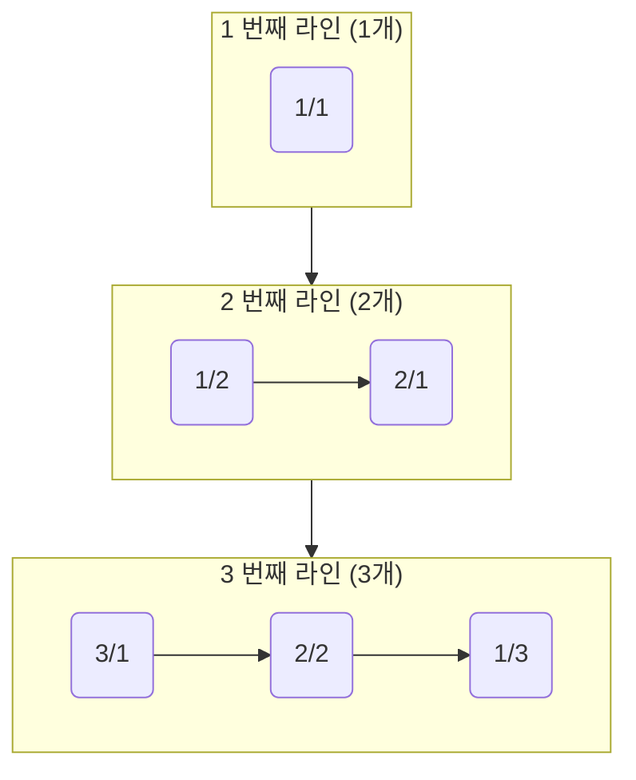

## 제목 : 분수찾기

---

### 문제

무한히 큰 배열에 다음과 같이 분수들이 적혀있다.

<br/>

|     |     |     |     |     |     |
|-----|-----|-----|-----|-----|-----|
| 1/1 | 1/2 | 1/3 | 1/4 | 1/5 | ... |
| 2/1 | 2/2 | 2/3 | 2/4 | ... | ... |
| 3/1 | 3/2 | 3/3 | ... | ... | ... |
| 4/1 | 4/2 | ... | ... | ... | ... |
| 5/1 | ... | ... | ... | ... | ... |
| ... | ... | ... | ... | ... | ... |

<br/>

이와 같이 나열된 분수들을 `1/1` -> `1/2` -> `2/1` -> `3/1` -> `2/2` -> ... 

와 같은 지그재그 순서로 차례대로 1번, 2번, 3번, 4번, 5번, ... 분수라고 하자.

`X` 가 주어졌을 때, `X` 번째 분수를 구하는 프로그램을 작성하시오.

### 입력

첫째 줄에 `X` (1 <= `X` <= 10,000,000) 가 주어진다.

### 출력

첫째 줄에 분수를 출력한다.

<br/>

### 예제 입력 1

```text
1
```

### 예제 출력 1

```text
1/1
```

<br/>

### 예제 입력 2

```text
2
```

### 예제 출력 2

```text
1/2
```

<br/>

### 예제 입력 3

```text
3
```

### 예제 출력 3

```text
2/1
```

<br/>

---

아마 **단계별로 풀어보기** 를 통해 알고리즘을 공부 한 사람이라면, 

자신이 기존에 가지고 있던 2 차원 배열에 대한 틀을 깨야 하는 문제라고 생각이 든다.

<br/>

그렇다면, 이 문제에 대한 인상을 먼저 살펴보자

1. 2 차원 배열에 최대한 많은 숫자를 넣어서 푸는건가?
2. 앞의 숫자는 "행" 을 따르고, 두 번째 숫자는 "열" (ex - `1/3`) 의 형태를 띄고 있다!
3. 지그재그 순서를 따른다고 하는데, 그렇다면 이걸 어떻게 구하지?

<br/>

사실 이 문제는, 어떠한 배열도 사용하지 않고 풀 수가 있다.

정확히 말하자면, 배열을 사용하면 정말 수많은 리소스가 사용되고 낭비된다.

<br/>

만약 실제로 최대 `X` 값인 **10,000,000** (천만) 이 주어진다고 가정하자.

그리고, 2차원 배열 **10,000,000** 을 `int` 로 구현한다고 생각해보지.

`int` 는 1 개당, `4 Byte` 의 크기를 가지고 있다.

`4` * `10,000,000` (Byte) 는, `40,000,000` 이다.

무려 초기화에 `40MB` 를 먼저 사용하고 들어가게 되는 것이다.

<br/>

물론, 문제의 메모리 제한 `256MB` 를 넘진 않지만, 

단순히 문제를 따져봤을 때도 2차원 배열의 사용은 이 문제를 푸는데 적합하지 않고,

오히려 돌아가는 길이라는 것이다.

<br/>

왜 그런지는 규칙을 분해하며 알아보자.

<br/>

### 배열의 재구성화

우리는 실제로 구현되야 할 분수의 형태를 정확히 알아내야 한다.

이 과정에서 배열을 바라보는 시각을 `반시계 방향으로 45 도` 꺾어보자.




<br/>

배열을 바라보는 시각을 약간 꺾어 바라보니, 규칙이 드러나기 시작한다.

1. N 번째 라인 내의 개수는 N 개이다.
2. N 번째 라인의 끝점은 `N/1` 이거나, `1/N` 이다.
3. 홀수 번째 라인은 왼쪽 수가 가장 크며, 짝수 번째 라인은 오른쪽 수가 가장 큰 상태로 시작한다.
    * 홀수 - `3/1`
    * 짝수 - `1/2`
4. N 번째 라인 내에 있는 모든 분수 숫자의 합 (분모 + 분자) 은 N + 1 이다.

<br/>

이러한 규칙들을 통해, 우리는 배열이 필요 없음을 깨닫는다!

### 그래서 <code>X</code> 번째 수를 어떻게 구하지?

곧바로 `X` 번째 수를 특정할 수는 없다.

하지만, 우리는 다르게 바라본 시각으로,

1 번째 라인은 1 개의 수.

2 번쨰 라인은 2 개의 수,

그리고 3 번째 라인은 3 개의 수를 가지고 있음을 알아냈다.

<br/>

즉, 우리는 `X` 번째 수를, 넘을 때 까지,

해당 번째 라인의 수를 지속적으로 더하면 된다는 것이다.

<br/>

쉽게 풀어서 이게 무슨 말이냐면,

예를 들어서 **11 번째 분수** 를 구한다고 가정 해 보자.

1 번째 라인 : 1 번째 분수 까지 포함.

2 번째 라인 : 3 번째 분수 까지 포함.

3 번째 라인 : 6 번째 분수 까지 포함.

4 번째 라인 : 10 번째 분수 까지 포함.

5 번째 라인 : 15 번째 분수까지 포함. - (`X` 를 초과함!)

이 과정에서, **11 번째 분수** 는 5 번째 라인에 포함된다고 말할 수 있다.

<br/>

### 중간에 있는 분수를 어떻게 구하나?

위에서 새로이 구축한 그래프를 통해 알아낸 규칙으로 구할 수 있다.

바로, <span style="color : skyblue">홀수 번째 라인은 왼쪽 수가 가장 크며, 짝수 번째 라인은 오른쪽 수가 가장 큰 상태로 시작한다</span> 이다.

즉, 5 번째 라인의 시작과 끝은

* 시작 : `5/1`
* 끝 : `1/5` 

이다. - 위에서 미리 발견했던 규칙을 이용한 것이다.

그렇다면, 우리는 "시작" or "끝" 에서 출발할지 결정하면 된다.

<br/>

**EX 1 - 시작 부분 부터 중간의 분수를 구하는 경우**

1. **11 번째 분수**는 5 번째 라인에 포함된다.
2. 시작 부분을 알기 위해서는, 4번째 라인(이전 라인)의 마지막 분수 번호를 알아야 한다.
3. 4 번째 라인의 마지막 분수 번째는 **"10"** 이었다.
4. 그렇다면 5 번째 라인의 1 번째 분수 번째는 **"11"** 이다.

정확히, `X - (5 번째 라인 첫 번째 분수 번호)` - `11 - 11` == `0`

만큼 시작 부분에서 이동하면 된다. - 즉, 0 번 이동하므로, 시작 부분이라는 의미.

<br/>

**EX 2 - 마지막 부분에서 중간의 분수를 구하는 경우**

1. 11 번째 분수는 4 번째 라인에 포함되지 않고, 5 번째 라인에 포함된다.
2. 마지막 부분 순서는 중첩하여 더하다 보니 **"15"** 번째 였다.
3. 우리가 구하려는 11 번째 분수는 "15" 번째 분수로부터 얼마나 이동해야 하는지 구해야 한다.
4. 정확히 "15" 번째로부터 1칸씩 11 번째 분수까지 이동한다고 가정 할 때, (15 -->  14 --> 13 --> 12 --> 11) 총 4번
5. 그렇다면, `(5 번째 라인 마지막 분수 번호) - X` 만큼 이동하면 된다.

즉, 마지막 분수에서 **4번** 이동한 분수의 형태를 구하면 된다.

<br/>

**Final - 시작과 끝 규칙이 서로 다른 라인들**

말하고자 하는 것은, 홀수 번째와 짝수 번째의 분수 시작, 분수 마지막 규칙이 서로 다르다는 것이다.

**<code>x</code> 는 이동 총량을 의미**

**홀수의 경우 (ex - N번째 라인)** : 
* Start : `N/1`
* End : `1/N`
* 진행 과정 : `(N - x)/(x + 1)` - 문자열

**짝수의 경우 (ex - N번째 라인)** : 
* Start : `1/N`
* End : `N/1`
* 진행 과정 : `(x + 1)/(N - x)` - 문자열 

<br/>

이제 답을 구하기 위한 모든 규칙들을 총망라 하여 정리 해 봤다.

답을 구해 보자.

## Answer

```java
import java.io.*;

public class Main {
    public static void main(String[] args) throws IOException {
        BufferedReader br = new BufferedReader(new InputStreamReader(System.in));
        
        int X = Integer.parseInt(br.readLine());
        
        // 시작 라인
        int currLine = 0;
       // 현재 분수 번호 초기화
        int currNumber = 0;
        
        // 현재까지 파악된 분수 번호가 X 보다 작을 때. - 넘으면 해당 라인에 포함된 것으로 간주.
        while(currNumber < X) {
            currNumber += (currLine + 1);
            currLine++;
        }
        
        // while 탈출 시, currLine 내에 `X` 번째 분수가 있다는 결과를 얻은 상태
       
        int frontNum = 0;
        int backNum = 0;
        
        // X 라인이 홀수 일 경우 - 시작 부분부터 중간의 분수를 구하는 경우
        if(currLine % 2 == 1) {
            // currLine 의 시작 분수 번째를 구해놓는다.
            int start = currNumber - currLine + 1;
            
            // 이동 총량은 중간의 X 번째 - 시작 번째.
            int move = X - start;
            
            frontNum = (currLine - move);
            backNum = (move + 1);
            
        } else { //  X 라인이 짝수 일 경우 - 마지막 부분부터 중간의 분수를 구하는 경우
            // currLine 의 마지막 분수 번째는 현재 currNumber 이다.
            int end = currNumber;
            
            // 마지막부터 시작하는 경우, 이동 총량은 마지막 - X 번째이다.
            int move = end - X;
            
            frontNum = (currLine - move);
            backNum = (move + 1);
        }
        
        System.out.println(frontNum + "/" + backNum);
    }
}
```

<br/>

참고로, `currLine`(현재 라인) 이 "홀수" 냐 "짝수" 냐에 따라서,

시작부터 참고하는 방식, 

마지막부터 참고하는 방식 

2 개의 방식을 다채롭게 작성해 놓았으니, 한번 해석해 보는것도 좋은 경험일 거라 예상한다.

